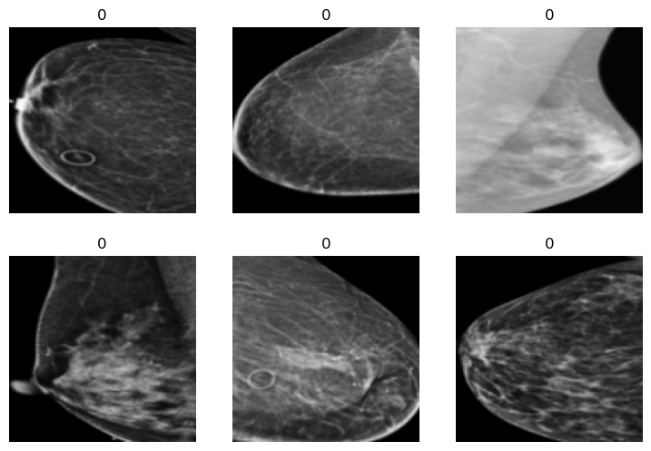
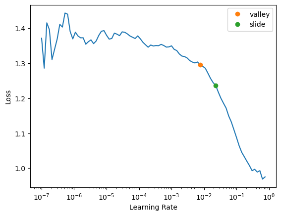

RSNA-\_Breast_Cancer_Detection
================

<!-- WARNING: THIS FILE WAS AUTOGENERATED! DO NOT EDIT! -->

``` python
```

    The autoreload extension is already loaded. To reload it, use:
      %reload_ext autoreload

``` python
from nbdev.showdoc import *
```

This file will become your README and also the index of your
documentation.

## Install

``` sh
pip install RSNA__Breast_Cancer_Detection
```

## How to use

### Small dataset creation: why?

- The problem is that, with all the images it takes almost 1 hour for
  each epoc
- Therefore need a subset of data for faster experimentation.
- Possitive image number is very less. So I tried to create the same
  distribution of in the newer smaller dataaset

### Small dataset creation: how?

- Split the data stratified way and take desired amount into training
  data
- Then use those training data
- We can create symbolic link to those subset of the data.

``` python
from pathlib import Path
import pandas as pd
import numpy as np
from fastai.vision.all import *
```

``` python
data_path = Path.cwd().parent/'data'/'bc_768_roi'
data_train_path = Path(data_path/'train')
data_test_path = Path(data_path/'test')
data_symlink_path = Path(r'/home/hasan/workspace/data/symlink/')
df_train = pd.read_csv(data_path/'train.csv.zip')
df_test = pd.read_csv(data_path/'test.csv')
```

``` python
df_test.head()
```

<div>
<style scoped>
    .dataframe tbody tr th:only-of-type {
        vertical-align: middle;
    }

    .dataframe tbody tr th {
        vertical-align: top;
    }

    .dataframe thead th {
        text-align: right;
    }
</style>
<table border="1" class="dataframe">
  <thead>
    <tr style="text-align: right;">
      <th></th>
      <th>site_id</th>
      <th>patient_id</th>
      <th>image_id</th>
      <th>laterality</th>
      <th>view</th>
      <th>age</th>
      <th>implant</th>
      <th>machine_id</th>
      <th>prediction_id</th>
    </tr>
  </thead>
  <tbody>
    <tr>
      <th>0</th>
      <td>2</td>
      <td>10008</td>
      <td>736471439</td>
      <td>L</td>
      <td>MLO</td>
      <td>81</td>
      <td>0</td>
      <td>21</td>
      <td>10008_L</td>
    </tr>
    <tr>
      <th>1</th>
      <td>2</td>
      <td>10008</td>
      <td>1591370361</td>
      <td>L</td>
      <td>CC</td>
      <td>81</td>
      <td>0</td>
      <td>21</td>
      <td>10008_L</td>
    </tr>
    <tr>
      <th>2</th>
      <td>2</td>
      <td>10008</td>
      <td>68070693</td>
      <td>R</td>
      <td>MLO</td>
      <td>81</td>
      <td>0</td>
      <td>21</td>
      <td>10008_R</td>
    </tr>
    <tr>
      <th>3</th>
      <td>2</td>
      <td>10008</td>
      <td>361203119</td>
      <td>R</td>
      <td>CC</td>
      <td>81</td>
      <td>0</td>
      <td>21</td>
      <td>10008_R</td>
    </tr>
  </tbody>
</table>
</div>

``` python
df_t = process_trn_df(df_train)
df_t.head()
```

<div>
<style scoped>
    .dataframe tbody tr th:only-of-type {
        vertical-align: middle;
    }

    .dataframe tbody tr th {
        vertical-align: top;
    }

    .dataframe thead th {
        text-align: right;
    }
</style>
<table border="1" class="dataframe">
  <thead>
    <tr style="text-align: right;">
      <th></th>
      <th>image_name</th>
      <th>cancer</th>
    </tr>
  </thead>
  <tbody>
    <tr>
      <th>0</th>
      <td>10006_462822612.png</td>
      <td>0</td>
    </tr>
    <tr>
      <th>1</th>
      <td>10006_1459541791.png</td>
      <td>0</td>
    </tr>
    <tr>
      <th>2</th>
      <td>10006_1864590858.png</td>
      <td>0</td>
    </tr>
    <tr>
      <th>3</th>
      <td>10006_1874946579.png</td>
      <td>0</td>
    </tr>
    <tr>
      <th>4</th>
      <td>10011_220375232.png</td>
      <td>0</td>
    </tr>
  </tbody>
</table>
</div>

``` python
strY = StratifyYSplitData(
                        X='image_name', 
                        Y='cancer',
                        df_t=df_t,
                        train_path=data_train_path,
                        test_size=0.9)

(xtrn, ytrn), (xval, yval) = strY.get_data()

print(f' Training size = {len(xtrn)},  and validation size = {len(xval)}')
```

     Training size = 5470,  and validation size = 49236

- Now create symbolic link to a folder with only this 5470 images

``` python
create_small_dataset(
                    destination_=data_symlink_path,
                    image_list=xtrn,
                    symlink_=True)
```

    Creating symbolic link of 5470 images in /home/hasan/workspace/data/symlink
     number of files found in /home/hasan/workspace/data/symlink == 5470

``` python
fn = get_image_files(data_symlink_path)
```

- Based on image name we need the label of subsequent images

``` python
trn_dict = strY.get_label_dict(
                               data_list='small',
                               image_list=fn)
```

``` python
trn_dict
```

    {'30327_282752780.png': 0,
     '4924_332703934.png': 0,
     '42747_1751140002.png': 0,
     '54980_2002547124.png': 0,
     '57680_52336442.png': 0,
     '58069_1048934956.png': 0,
     '10011_220375232.png': 0,
     '4115_900722943.png': 0,
     '37510_1125771757.png': 0,
     '55249_1459512180.png': 0,
     '13256_657470934.png': 0,
     '41584_784731834.png': 0,
     '58168_1277856808.png': 0,
     '6590_2000707656.png': 0,
     '58906_1851980995.png': 0,
     '55116_2088273698.png': 0,
     '52012_1550487859.png': 0,
     '46124_1647466399.png': 0,
     '26965_173743477.png': 0,
     '33647_891228696.png': 0,
     '17407_842697038.png': 0,
     '55335_1788738342.png': 0,
     '26185_1971298674.png': 0,
     '15173_2129624413.png': 0,
     '4049_810506537.png': 0,
     '5645_302172273.png': 0,
     '58346_29494406.png': 0,
     '25253_1599411245.png': 0,
     '62963_1389872397.png': 0,
     '55822_1905286797.png': 0,
     '63706_1241091399.png': 1,
     '11394_519343164.png': 0,
     '3053_1035162651.png': 0,
     '64152_788650096.png': 0,
     '59704_1118223910.png': 0,
     '6022_178374736.png': 0,
     '50570_605426107.png': 0,
     '12839_599809899.png': 0,
     '63840_1382859286.png': 0,
     '19503_239192703.png': 0,
     '53530_272603389.png': 0,
     '27021_1663203017.png': 0,
     '26948_522172629.png': 0,
     '46131_1177734048.png': 0,
     '64708_1927212037.png': 0,
     '44186_317775430.png': 0,
     '8325_1651262367.png': 0,
     '19094_1386428053.png': 0,
     '41973_1357857776.png': 0,
     '26298_428004883.png': 0,
     '48111_1672342770.png': 0,
     '2756_2091139179.png': 0,
     '9664_2057252020.png': 0,
     '41856_1722308795.png': 0,
     '23604_604905139.png': 0,
     '51277_62688403.png': 0,
     '40888_1809415485.png': 0,
     '35045_975358476.png': 0,
     '12989_1079203207.png': 0,
     '8820_921839697.png': 0,
     '49586_2067146476.png': 0,
     '21519_875591935.png': 0,
     '25208_1073517167.png': 0,
     '36894_1322958066.png': 0,
     '43963_732115853.png': 0,
     '53353_294205940.png': 0,
     '64766_437017505.png': 0,
     '806_886957103.png': 0,
     '29920_1169350809.png': 0,
     '54009_688632165.png': 0,
     '7940_834767145.png': 0,
     '32770_1280343318.png': 1,
     '10144_1830062849.png': 0,
     '51870_2110517381.png': 0,
     '393_1359539942.png': 0,
     '8053_2033993212.png': 0,
     '57476_1264805357.png': 0,
     '28989_1880776532.png': 1,
     '58817_298772190.png': 0,
     '11919_1438944952.png': 0,
     '32252_831862963.png': 1,
     '52509_930239507.png': 0,
     '28231_1522119158.png': 0,
     '20733_868878741.png': 0,
     '7732_1138233740.png': 0,
     '36428_1486040773.png': 0,
     '30029_181940018.png': 0,
     '56304_1935403874.png': 0,
     '36508_175730649.png': 0,
     '63982_734134269.png': 0,
     '21851_1435450494.png': 0,
     '3572_615216970.png': 0,
     '27379_354088534.png': 0,
     '17981_1242437557.png': 0,
     '64603_1881785214.png': 0,
     '6283_401218806.png': 0,
     '54774_318466509.png': 0,
     '15945_1740886467.png': 0,
     '42828_235119179.png': 0,
     '49728_1192302137.png': 0,
     '25963_1260507486.png': 0,
     '45207_1354810823.png': 0,
     '51276_1529137775.png': 0,
     '56118_509015173.png': 0,
     '15156_509417747.png': 0,
     '16143_1771888236.png': 0,
     '16887_1734028439.png': 0,
     '3575_1011761143.png': 0,
     '41555_1391398726.png': 0,
     '32340_2099584993.png': 0,
     '21368_1218773845.png': 0,
     '5777_1947534363.png': 0,
     '64025_490144038.png': 0,
     '59782_46120512.png': 0,
     '55605_1367285411.png': 0,
     '9928_174719796.png': 0,
     '57877_1319410250.png': 0,
     '48852_1631092327.png': 1,
     '13681_691297073.png': 0,
     '64133_837300781.png': 0,
     '42540_70087866.png': 0,
     '42600_510351918.png': 0,
     '22844_557425151.png': 0,
     '48667_1955182117.png': 0,
     '13009_573935520.png': 0,
     '33786_458057613.png': 0,
     '825_1088294620.png': 0,
     '9227_1520923209.png': 0,
     '15867_2120961337.png': 0,
     '60200_969876198.png': 0,
     '24954_1766399811.png': 0,
     '49793_1717234801.png': 0,
     '45557_277348103.png': 0,
     '40496_1420465635.png': 0,
     '7541_1360548691.png': 0,
     '9954_403809542.png': 0,
     '54085_1688164815.png': 0,
     '8785_402462048.png': 0,
     '12149_2134134659.png': 0,
     '59890_930020649.png': 0,
     '52234_1963216468.png': 0,
     '5817_1664818921.png': 0,
     '21462_1413931228.png': 0,
     '48880_502264351.png': 0,
     '19700_1309669876.png': 0,
     '56441_1553059518.png': 0,
     '17750_1959221773.png': 0,
     '44047_2054767820.png': 0,
     '61771_654935556.png': 0,
     '43203_2005521784.png': 0,
     '14469_404839081.png': 0,
     '10413_1049168020.png': 0,
     '18677_96093036.png': 0,
     '24231_1719791686.png': 0,
     '3321_1638751333.png': 0,
     '40276_1923977135.png': 0,
     '11350_399824442.png': 0,
     '23276_1392248713.png': 0,
     '13566_1056128015.png': 0,
     '45140_450895214.png': 0,
     '57441_1177425144.png': 0,
     '703_1124901329.png': 0,
     '57415_1501391055.png': 0,
     '42501_536984017.png': 0,
     '32977_1529423287.png': 0,
     '40001_2043608238.png': 0,
     '64335_612444866.png': 0,
     '46640_2003115566.png': 0,
     '22928_260131559.png': 0,
     '19309_142432854.png': 0,
     '22562_1491977729.png': 0,
     '8847_946680818.png': 0,
     '5185_20414049.png': 0,
     '4725_1462213576.png': 0,
     '51490_469520600.png': 0,
     '26123_298910139.png': 0,
     '28284_739728353.png': 0,
     '1322_1008790576.png': 0,
     '47790_118521349.png': 0,
     '48681_1272359408.png': 0,
     '24627_1614937803.png': 0,
     '14004_579976044.png': 0,
     '20741_209994568.png': 0,
     '44758_1637941497.png': 0,
     '34744_1770132803.png': 0,
     '59137_1717538225.png': 0,
     '32378_1223011407.png': 0,
     '29037_436926151.png': 0,
     '19354_957012052.png': 0,
     '32424_738156499.png': 0,
     '46775_634945354.png': 0,
     '12484_916573113.png': 0,
     '34001_1957127166.png': 0,
     '50691_1466496429.png': 0,
     '14406_1978849453.png': 0,
     '49016_489889140.png': 0,
     '37746_1864671278.png': 0,
     '16167_916509136.png': 0,
     '60302_377148727.png': 0,
     '828_867505823.png': 0,
     '38036_1687049577.png': 0,
     '41537_182808013.png': 0,
     '5110_168639181.png': 0,
     '30753_906970751.png': 0,
     '5309_857830085.png': 0,
     '14188_75119749.png': 0,
     '60259_1574346518.png': 0,
     '34192_819738350.png': 0,
     '59530_1399974673.png': 0,
     '38661_905762370.png': 0,
     '30865_1638771177.png': 0,
     '32705_2062164326.png': 0,
     '37203_284527479.png': 0,
     '57798_2034522527.png': 0,
     '52642_363995409.png': 0,
     '3522_2042922334.png': 0,
     '19033_619193371.png': 0,
     '2815_1971482084.png': 0,
     '42358_720057137.png': 0,
     '21305_1304742223.png': 0,
     '51939_289792004.png': 0,
     '59601_531832214.png': 0,
     '15573_397277886.png': 0,
     '6943_505223741.png': 0,
     '33319_965355636.png': 0,
     '17868_1325050677.png': 0,
     '38034_82436246.png': 0,
     '12653_1496769577.png': 0,
     '61825_1335802158.png': 1,
     '44172_1445412710.png': 0,
     '28773_1731652406.png': 0,
     '18646_1189625864.png': 0,
     '22634_649510685.png': 0,
     '53920_1821887404.png': 0,
     '49102_1395076535.png': 0,
     '51875_197837801.png': 0,
     '28443_909970520.png': 0,
     '28467_1167888675.png': 0,
     '36397_1292147492.png': 0,
     '61975_912234547.png': 0,
     '24752_1546041515.png': 0,
     '16316_1970577407.png': 0,
     '23633_1182498482.png': 0,
     '54713_1573858099.png': 0,
     '2738_344392941.png': 0,
     '50729_2040887732.png': 0,
     '16719_994290291.png': 0,
     '7268_1996895131.png': 0,
     '23876_983151447.png': 0,
     '12321_824472566.png': 0,
     '4590_23302241.png': 0,
     '29816_277058515.png': 0,
     '46183_605890277.png': 0,
     '56138_679721337.png': 0,
     '25307_1729361007.png': 0,
     '41238_1152046649.png': 0,
     '1149_13984309.png': 0,
     '38571_1587127230.png': 0,
     '65352_340710370.png': 0,
     '15493_153055156.png': 0,
     '28117_1448225467.png': 0,
     '29228_185886586.png': 0,
     '55695_1086715165.png': 0,
     '33465_2011136561.png': 0,
     '31364_477811773.png': 0,
     '16879_2063721802.png': 0,
     '30895_1147033408.png': 0,
     '52379_1942758486.png': 0,
     '15285_1502578195.png': 0,
     '28_2108025467.png': 0,
     '31165_1953661185.png': 0,
     '15259_1233060909.png': 0,
     '3001_512307582.png': 0,
     '54869_929344703.png': 0,
     '5919_1340260733.png': 0,
     '1852_2076003064.png': 0,
     '34349_1433982072.png': 0,
     '26576_1619360925.png': 0,
     '24398_217852251.png': 0,
     '25433_165655136.png': 0,
     '51898_1172543472.png': 0,
     '13681_1713022006.png': 0,
     '28522_1909387012.png': 0,
     '12393_873736292.png': 0,
     '8790_1472011049.png': 0,
     '19573_454757150.png': 0,
     '9014_2058123035.png': 1,
     '22937_1930272915.png': 0,
     '49430_295993299.png': 0,
     '31148_1668075471.png': 0,
     '9808_1967629147.png': 0,
     '4988_52083104.png': 0,
     '19715_463753023.png': 0,
     '9767_2071267719.png': 0,
     '57414_408533433.png': 0,
     '52243_1930998441.png': 0,
     '48502_1766697432.png': 0,
     '56977_1353257683.png': 0,
     '40602_688387708.png': 0,
     '44692_494623649.png': 0,
     '48417_1518570962.png': 0,
     '29319_64054131.png': 0,
     '49552_729923768.png': 0,
     '34349_457295443.png': 0,
     '8630_1668178272.png': 0,
     '22494_1486265295.png': 0,
     '49176_1538523389.png': 1,
     '21486_829415917.png': 0,
     '14232_603331436.png': 0,
     '6795_912093375.png': 0,
     '8361_574346017.png': 0,
     '52438_426319834.png': 0,
     '7265_921611377.png': 0,
     '39042_171599886.png': 0,
     '47673_1583323112.png': 1,
     '25334_1000475373.png': 0,
     '56940_736850811.png': 0,
     '43660_763647216.png': 0,
     '48352_1884296769.png': 0,
     '54588_746343134.png': 0,
     '32355_1753106972.png': 0,
     '7644_1930206882.png': 0,
     '63172_65276753.png': 0,
     '13900_1649956097.png': 0,
     '51889_1276652269.png': 0,
     '8041_1241468087.png': 0,
     '39424_66804335.png': 0,
     '25269_272351741.png': 0,
     '55706_1452674286.png': 0,
     '21789_599842250.png': 0,
     '14197_2096656042.png': 0,
     '34044_1631742712.png': 0,
     '56602_1824198511.png': 0,
     '42964_317013931.png': 0,
     '49_1504346730.png': 0,
     '30977_1230736508.png': 0,
     '39244_227581197.png': 0,
     '46796_1843991830.png': 0,
     '51914_1632913222.png': 0,
     '55397_1471457136.png': 0,
     '31745_858423331.png': 0,
     '41238_1969581106.png': 1,
     '28702_992732659.png': 0,
     '24111_1913779264.png': 0,
     '11755_2039406817.png': 0,
     '3944_2054214525.png': 0,
     '17154_1975704724.png': 0,
     '31972_1265559005.png': 0,
     '5325_517967922.png': 0,
     '582_1763930751.png': 0,
     '23440_1256381396.png': 0,
     '49556_1710543660.png': 0,
     '3383_26698955.png': 0,
     '25399_864742559.png': 0,
     '38831_599270552.png': 0,
     '22646_1411702523.png': 0,
     '57666_1808392438.png': 0,
     '39238_1610303261.png': 0,
     '13151_1463768909.png': 0,
     '54382_605741630.png': 0,
     '45469_274324971.png': 0,
     '20345_696887277.png': 0,
     '62436_865502713.png': 0,
     '3463_950315175.png': 0,
     '42244_159557093.png': 0,
     '6637_1016408119.png': 1,
     '57077_935836999.png': 0,
     '1179_399222572.png': 0,
     '29297_1012190710.png': 0,
     '14146_1701042792.png': 0,
     '34760_868662889.png': 0,
     '12353_503677846.png': 0,
     '7606_1338884622.png': 0,
     '44300_1441967668.png': 0,
     '26080_534254546.png': 0,
     '30741_849558309.png': 0,
     '2599_1781563911.png': 0,
     '14780_2003308850.png': 0,
     '63022_620547991.png': 0,
     '59806_705873233.png': 1,
     '3734_348238569.png': 0,
     '47889_406117836.png': 0,
     '25865_1953264377.png': 0,
     '4370_1906676275.png': 0,
     '36788_540236747.png': 0,
     '11284_492172232.png': 0,
     '46662_355709546.png': 0,
     '59700_275857147.png': 0,
     '34053_238449586.png': 1,
     '17466_464295685.png': 0,
     '41051_379442839.png': 0,
     '16638_1462677543.png': 0,
     '25118_1013941893.png': 0,
     '47197_91365722.png': 0,
     '33639_1612565445.png': 0,
     '52438_1937529587.png': 0,
     '34444_895397759.png': 0,
     '1775_1269931914.png': 1,
     '17078_1007365058.png': 0,
     '33545_1042366360.png': 0,
     '58280_1642925946.png': 0,
     '48146_618263242.png': 0,
     '58102_1753894491.png': 0,
     '51985_42754403.png': 0,
     '20428_835522738.png': 0,
     '31167_1924307602.png': 0,
     '25565_1345005120.png': 0,
     '56613_1412943088.png': 0,
     '30695_1582751624.png': 0,
     '59297_491008075.png': 0,
     '16145_763624337.png': 0,
     '44898_953293108.png': 0,
     '26954_32592870.png': 0,
     '2804_973441430.png': 0,
     '65453_2091616075.png': 0,
     '45190_2089683322.png': 0,
     '13356_1191921083.png': 0,
     '448_1501241239.png': 0,
     '49130_2141732074.png': 0,
     '47748_1532828928.png': 0,
     '62706_1184647867.png': 0,
     '52390_348553780.png': 0,
     '31055_1969193760.png': 0,
     '63156_480607477.png': 0,
     '27903_1466906292.png': 0,
     '7891_239202271.png': 0,
     '35673_1084477933.png': 0,
     '15774_1602318482.png': 0,
     '55443_1698883381.png': 0,
     '23004_1377475453.png': 0,
     '8066_2004090724.png': 0,
     '46669_1854437749.png': 0,
     '8701_1232747918.png': 0,
     '16613_1208705082.png': 0,
     '44477_886307319.png': 0,
     '55724_5703298.png': 0,
     '19581_216021014.png': 0,
     '37458_1962323021.png': 0,
     '1323_321910247.png': 0,
     '37757_1900478953.png': 0,
     '21720_1900007287.png': 1,
     '42526_1143264783.png': 0,
     '60534_942931229.png': 0,
     '63768_762826582.png': 0,
     '10273_966712981.png': 0,
     '21180_707793992.png': 0,
     '54263_11018337.png': 0,
     '26765_397441727.png': 0,
     '9965_1229053771.png': 0,
     '4736_1143721789.png': 0,
     '61245_1205905257.png': 0,
     '19109_1549529032.png': 0,
     '1890_1938942288.png': 0,
     '38037_989102421.png': 0,
     '46359_1110055596.png': 0,
     '9635_581990984.png': 0,
     '28242_233201459.png': 0,
     '35489_1632604308.png': 0,
     '45034_874804099.png': 0,
     '38569_1256534565.png': 0,
     '55610_1331653317.png': 0,
     '1724_1305183381.png': 0,
     '24566_2113818633.png': 0,
     '62947_403544542.png': 0,
     '61149_1212686024.png': 0,
     '11799_1324896113.png': 0,
     '29552_555368902.png': 0,
     '26315_656228771.png': 0,
     '48298_1696976523.png': 0,
     '17270_731262862.png': 0,
     '6107_1557292062.png': 0,
     '40744_1541842360.png': 0,
     '35145_1644307068.png': 0,
     '22046_751016694.png': 0,
     '36922_339183927.png': 0,
     '5059_1712353368.png': 0,
     '7610_1507665214.png': 0,
     '17825_679805864.png': 0,
     '7175_1709123485.png': 0,
     '19383_1463959325.png': 0,
     '34534_1173486331.png': 0,
     '1776_788154021.png': 0,
     '45010_1363831396.png': 0,
     '46377_1537551467.png': 0,
     '36012_193236130.png': 0,
     '55969_2089051104.png': 0,
     '19306_464418949.png': 0,
     '33283_1299245641.png': 0,
     '36680_572988849.png': 0,
     '43874_2038884823.png': 0,
     '8945_120802214.png': 0,
     '15286_1142955456.png': 0,
     '14900_2047059222.png': 0,
     '6986_1019148300.png': 0,
     '32060_1914359930.png': 0,
     '12125_272242247.png': 0,
     '1960_126238619.png': 0,
     '45526_385164502.png': 0,
     '28408_1157373660.png': 0,
     '40830_986623611.png': 0,
     '19956_483481151.png': 0,
     '4590_1742849228.png': 0,
     '54203_1005678624.png': 0,
     '53085_1521133100.png': 0,
     '38956_1001591164.png': 0,
     '38576_974245123.png': 0,
     '46733_322840598.png': 0,
     '4953_94584715.png': 1,
     '2821_820433520.png': 0,
     '63317_1076365480.png': 0,
     '47278_1288134931.png': 0,
     '56118_283212125.png': 0,
     '8545_47245736.png': 0,
     '1342_1032595121.png': 0,
     '49063_1446563917.png': 0,
     '16728_585515574.png': 0,
     '29350_1735958172.png': 0,
     '42862_565797240.png': 0,
     '31629_212709906.png': 0,
     '23429_1626868326.png': 0,
     '9089_1180003702.png': 0,
     '50181_868213130.png': 0,
     '55078_157347231.png': 0,
     '12353_1024872256.png': 0,
     '47938_1751637197.png': 0,
     '12264_360125147.png': 0,
     '37239_1611674798.png': 0,
     '9814_1149002441.png': 0,
     '46143_2054337156.png': 0,
     '31466_1540283045.png': 0,
     '15313_1936963086.png': 0,
     '53558_1022943882.png': 0,
     '21464_1112281356.png': 0,
     '36894_312383276.png': 0,
     '14246_838636280.png': 0,
     '40272_1534166104.png': 0,
     '27388_2020424489.png': 0,
     '15717_1341629187.png': 0,
     '10494_303135972.png': 0,
     '6691_1966158333.png': 0,
     '56491_2041964835.png': 1,
     '47155_682136392.png': 0,
     '56672_705477835.png': 0,
     '32975_1398489149.png': 0,
     '36378_2052161239.png': 0,
     '3021_1244768921.png': 0,
     '8900_1728746033.png': 0,
     '46671_1049651035.png': 0,
     '47068_548860897.png': 0,
     '61125_698462650.png': 0,
     '25778_530531043.png': 0,
     '43306_1821036348.png': 0,
     '1688_1695802156.png': 0,
     '33319_1828525385.png': 0,
     '1122_1791019677.png': 0,
     '25124_1113367277.png': 0,
     '51905_951330285.png': 0,
     '9658_2103794728.png': 0,
     '46315_251237494.png': 0,
     '3462_483614928.png': 0,
     '44941_1734887163.png': 0,
     '40653_1900212864.png': 0,
     '52907_1979620954.png': 0,
     '44621_943029797.png': 0,
     '30512_1716041932.png': 0,
     '25211_267584226.png': 0,
     '50236_301354949.png': 0,
     '12164_1969589039.png': 0,
     '48748_886929420.png': 0,
     '18952_286626449.png': 0,
     '49552_1525325413.png': 0,
     '47309_1934907241.png': 0,
     '2190_726691688.png': 0,
     '16369_1583251467.png': 0,
     '36268_2104883083.png': 0,
     '59398_1707535651.png': 0,
     '34743_1412709743.png': 0,
     '56461_480339140.png': 0,
     '24006_794535114.png': 0,
     '24708_1370895472.png': 0,
     '26515_776661004.png': 0,
     '37478_223431524.png': 0,
     '28776_1006815222.png': 0,
     '16881_1965649198.png': 0,
     '12867_1185706707.png': 0,
     '19498_510896442.png': 0,
     '20139_1619526343.png': 0,
     '10884_380407567.png': 0,
     '55931_456342981.png': 0,
     '49776_1779748257.png': 0,
     '1147_2015757392.png': 0,
     '59488_2093679742.png': 0,
     '8974_212390556.png': 0,
     '1187_1642680228.png': 0,
     '53124_1937279221.png': 0,
     '12816_355243809.png': 0,
     '8865_159534950.png': 0,
     '51497_710661717.png': 0,
     '27346_362348338.png': 0,
     '33428_383575280.png': 0,
     '19903_564199461.png': 0,
     '46095_2141709197.png': 1,
     '43705_1739318514.png': 0,
     '37252_40485023.png': 0,
     '47847_767389748.png': 0,
     '36723_1868047575.png': 0,
     '53091_1599683082.png': 0,
     '19756_2070084360.png': 0,
     '4917_1773963138.png': 1,
     '50002_1302710296.png': 0,
     '27613_189300287.png': 0,
     '47890_738149269.png': 0,
     '18380_44080490.png': 0,
     '21578_304298881.png': 0,
     '49622_1967282195.png': 0,
     '63688_1496435656.png': 0,
     '55245_2082455260.png': 0,
     '48445_1859895932.png': 0,
     '29561_1447477829.png': 0,
     '58398_1620798005.png': 1,
     '58874_1626463067.png': 0,
     '35445_1307115055.png': 0,
     '52516_1122502292.png': 0,
     '53866_905799734.png': 0,
     '38128_833528732.png': 0,
     '48166_603523502.png': 0,
     '47819_465677536.png': 0,
     '16730_1438495261.png': 0,
     '26679_1137678042.png': 0,
     '52334_1593426305.png': 0,
     '16136_14716440.png': 0,
     '10152_1280087654.png': 0,
     '1061_1982211851.png': 0,
     '6090_1017501729.png': 0,
     '21456_842493553.png': 0,
     '3807_1225044698.png': 0,
     '1544_1705487170.png': 0,
     '55281_1621591454.png': 0,
     '45357_478760553.png': 0,
     '63981_1823834630.png': 0,
     '15388_1589166842.png': 0,
     '41613_171232675.png': 0,
     '1899_2035969521.png': 0,
     '25823_503214110.png': 0,
     '16249_488848855.png': 0,
     '33699_1229936194.png': 0,
     '44880_1698314735.png': 0,
     '26963_1818126400.png': 0,
     '16136_720621564.png': 0,
     '50563_217306081.png': 0,
     '54922_419056614.png': 0,
     '32533_1154407860.png': 0,
     '40552_1856007658.png': 0,
     '18346_192979800.png': 0,
     '13757_1082923810.png': 0,
     '46605_185542058.png': 0,
     '19960_559538218.png': 0,
     '53189_1479967269.png': 0,
     '54774_26444503.png': 0,
     '49241_220798839.png': 0,
     '4725_1237558342.png': 0,
     '23226_1962103561.png': 0,
     '24231_1599132094.png': 0,
     '15514_392037395.png': 0,
     '30824_2065242261.png': 0,
     '32311_2072398544.png': 0,
     '38601_663582839.png': 0,
     '19625_1585397732.png': 0,
     '19299_673495123.png': 0,
     '47699_1056824942.png': 0,
     '39190_1528461562.png': 0,
     '30103_1362869339.png': 0,
     '37878_686221316.png': 0,
     '3466_1644813120.png': 0,
     '37392_768174917.png': 0,
     '45571_173140191.png': 0,
     '9561_1918629441.png': 0,
     '5590_1380903818.png': 0,
     '56541_1203383836.png': 0,
     '37590_670347643.png': 0,
     '14781_681957876.png': 0,
     '28396_1723314149.png': 0,
     '16887_2006489418.png': 0,
     '49820_1618143881.png': 0,
     '29092_945341926.png': 0,
     '46774_854367487.png': 0,
     '59359_4479005.png': 0,
     '55002_1122354139.png': 0,
     '17755_727084874.png': 0,
     '51113_142265206.png': 0,
     '62628_369783531.png': 0,
     '54011_2032102490.png': 0,
     '52857_485722785.png': 0,
     '52334_1438120661.png': 0,
     '60968_1266999321.png': 0,
     '31347_1948495522.png': 0,
     '64209_36694209.png': 0,
     '25201_197233170.png': 0,
     '12047_404122403.png': 0,
     '56638_449089819.png': 0,
     '56991_179544145.png': 0,
     '35413_1412585836.png': 0,
     '17626_1564176103.png': 0,
     '35864_1558139643.png': 1,
     '11385_886870015.png': 0,
     '55242_1322183298.png': 0,
     '64708_18835104.png': 0,
     '20199_694023056.png': 0,
     '15228_1256554595.png': 0,
     '29239_721849514.png': 0,
     '20368_848155487.png': 0,
     '51549_7336492.png': 0,
     '20695_1203375301.png': 0,
     '36946_1240505553.png': 0,
     '54685_607866123.png': 0,
     '17209_946986440.png': 0,
     '64848_425840965.png': 0,
     '44073_462788087.png': 0,
     '55657_210310253.png': 0,
     '59979_1232893228.png': 0,
     '56725_1761416027.png': 0,
     '35195_950714814.png': 0,
     '26178_1943689131.png': 0,
     '43370_1255486389.png': 0,
     '30097_1018711541.png': 0,
     '122_273696199.png': 0,
     '49823_2027174243.png': 0,
     '48612_1982368053.png': 0,
     '24618_1995419096.png': 0,
     '19446_1557809414.png': 0,
     '36432_672669006.png': 0,
     '9633_943985260.png': 0,
     '48208_68080099.png': 0,
     '58444_458316355.png': 0,
     '24937_14022086.png': 0,
     '14747_1656667569.png': 0,
     '45848_2048011942.png': 0,
     '54067_1529250808.png': 0,
     '39422_48853382.png': 0,
     '15117_1630151354.png': 0,
     '60292_2062442508.png': 0,
     '52805_610398635.png': 0,
     '48204_1048657988.png': 0,
     '47804_784646980.png': 0,
     '61720_915699092.png': 0,
     '37847_2116124839.png': 0,
     '21161_588872062.png': 0,
     '38739_1889694445.png': 0,
     '26815_1621079645.png': 0,
     '55596_697792471.png': 0,
     '64852_411788339.png': 0,
     '55203_858893412.png': 0,
     '29826_973312858.png': 0,
     '50005_421053639.png': 0,
     '47309_256050868.png': 0,
     '46208_753027080.png': 0,
     '60638_489364137.png': 0,
     '47387_1402400836.png': 0,
     '7397_1708692259.png': 0,
     '28321_2038934866.png': 0,
     '1721_1326132581.png': 0,
     '8317_534231373.png': 0,
     '45193_1998958485.png': 0,
     '2896_1121560897.png': 0,
     '61375_560113191.png': 0,
     '30326_1480603620.png': 0,
     '59410_1333862487.png': 0,
     '7780_987430935.png': 0,
     '1638_1923297632.png': 0,
     '60857_1423003148.png': 0,
     '61795_1911452170.png': 0,
     '37469_1535122442.png': 0,
     '32580_2065066003.png': 0,
     '40819_824492964.png': 0,
     '27122_877606663.png': 0,
     '49239_1767858198.png': 0,
     '65298_2119497208.png': 0,
     '3921_1167443584.png': 0,
     '16361_1119760511.png': 0,
     '4063_1221787888.png': 0,
     '4796_986029096.png': 0,
     '45260_242884485.png': 0,
     '25707_1589528760.png': 0,
     '25588_328295179.png': 0,
     '26740_1353407115.png': 0,
     '19499_1043327287.png': 0,
     '43390_1666898917.png': 0,
     '57844_906725620.png': 0,
     '20023_1237427569.png': 0,
     '36723_1919983290.png': 0,
     '4019_1135968417.png': 0,
     '42828_47425061.png': 0,
     '32841_642750110.png': 0,
     '3280_288754164.png': 0,
     '8079_1254953166.png': 0,
     '46043_133255741.png': 0,
     '59848_696408233.png': 0,
     '48699_714273532.png': 0,
     '26242_539754241.png': 0,
     '44055_80577254.png': 0,
     '7058_772783821.png': 0,
     '62448_1230291291.png': 0,
     '2989_406764921.png': 1,
     '43061_2117169536.png': 0,
     '34845_1741767166.png': 0,
     '54291_1768304841.png': 0,
     '39248_103699143.png': 0,
     '40485_346021946.png': 0,
     '17845_430821356.png': 0,
     '27890_971594840.png': 0,
     '35208_1843566562.png': 0,
     '39032_1105443206.png': 0,
     '29152_1607662103.png': 0,
     '10910_1175199418.png': 0,
     '10615_272324501.png': 0,
     '33943_57911503.png': 0,
     '64023_400927422.png': 0,
     '13248_1134141392.png': 0,
     '18777_1805591529.png': 0,
     '55608_1411135481.png': 0,
     '2311_1162941650.png': 0,
     '45896_1734681783.png': 0,
     '31359_514539703.png': 0,
     '12166_907296039.png': 0,
     '42315_919066805.png': 0,
     '59751_65924347.png': 0,
     '40453_36093234.png': 0,
     '11323_2116272365.png': 0,
     '1504_1109052502.png': 0,
     '57768_1408988953.png': 0,
     '40195_1958334381.png': 0,
     '62401_779116257.png': 0,
     '12501_865056445.png': 0,
     '7453_806699549.png': 0,
     '22369_2083134012.png': 0,
     '65149_331653273.png': 0,
     '49099_1887380887.png': 0,
     '33804_1281657212.png': 0,
     '46455_1745523061.png': 0,
     '6232_1475900197.png': 0,
     '33545_436480937.png': 0,
     '40941_762018265.png': 0,
     '24701_1532473501.png': 0,
     '61825_1393774797.png': 0,
     '49083_1985293833.png': 0,
     '39172_404753879.png': 0,
     '50226_1653228545.png': 0,
     '36282_847278356.png': 0,
     '17418_1784586768.png': 0,
     '14791_1263008406.png': 0,
     '2856_764396665.png': 0,
     '1511_503850980.png': 0,
     '31680_2031237566.png': 0,
     '16497_42952241.png': 0,
     '58718_1219028165.png': 0,
     '1676_97192793.png': 0,
     '59653_727628905.png': 0,
     '72_263272911.png': 0,
     '38466_1522436581.png': 0,
     '32841_2128331376.png': 0,
     '1740_1189243598.png': 0,
     '43860_1556890772.png': 0,
     '19669_755177617.png': 0,
     '21068_59910215.png': 0,
     '29388_353280693.png': 0,
     '8836_1132639562.png': 0,
     '58635_216044855.png': 0,
     '8689_681117443.png': 0,
     '49387_456862586.png': 0,
     '65170_1169795188.png': 0,
     '60220_1203497397.png': 0,
     '28275_1368571682.png': 0,
     '25663_529694438.png': 0,
     '59289_1708496639.png': 0,
     '57917_1568465734.png': 0,
     '37047_1317639456.png': 0,
     '48828_210906979.png': 0,
     '38693_1019959557.png': 0,
     '58663_1812273324.png': 0,
     '29768_309005418.png': 0,
     '32460_1928891968.png': 0,
     '61156_1827194726.png': 0,
     '12728_1315445761.png': 0,
     '43438_1416696462.png': 0,
     '48309_1131168002.png': 0,
     '65246_560536943.png': 0,
     '54099_1260101829.png': 0,
     '8933_920212119.png': 0,
     '29836_346499122.png': 0,
     '25678_1750367645.png': 0,
     '10086_1973073874.png': 0,
     '28522_903982204.png': 0,
     '29986_236118556.png': 0,
     '22309_902339606.png': 0,
     '59164_787639510.png': 0,
     '44534_583210892.png': 0,
     '55912_1419906003.png': 0,
     '45868_1775029041.png': 0,
     '19724_1570410173.png': 0,
     '16198_345242790.png': 0,
     '2679_1595139435.png': 1,
     '32859_1754515298.png': 0,
     '63299_1390703877.png': 0,
     '19698_484773174.png': 0,
     '60509_265596632.png': 0,
     '40481_778943147.png': 0,
     '24922_504635833.png': 0,
     '63982_532980597.png': 0,
     '31906_1494939850.png': 0,
     '25532_1046626205.png': 0,
     '28367_881917518.png': 0,
     '6743_1467059311.png': 0,
     '177_1931252969.png': 0,
     '31234_1983899333.png': 0,
     '17358_864767431.png': 0,
     '12312_1095560565.png': 0,
     '26306_250167283.png': 0,
     '38426_1457081866.png': 0,
     '39719_1586099060.png': 0,
     '14316_766403430.png': 0,
     '9030_884560650.png': 0,
     '58105_972263938.png': 0,
     '32272_125747255.png': 0,
     '28750_802148679.png': 0,
     '43100_2128031365.png': 0,
     '21695_297282638.png': 0,
     '5406_1713583474.png': 0,
     '63208_443253602.png': 0,
     '13369_223118760.png': 0,
     '44783_701049600.png': 0,
     '55979_1378494206.png': 0,
     '8289_1257482390.png': 0,
     '19585_1304326004.png': 0,
     '46828_1754281020.png': 0,
     '25219_264392762.png': 0,
     '26152_586954500.png': 0,
     '53577_675852197.png': 0,
     '60089_539806137.png': 0,
     '53572_1392091989.png': 0,
     '50553_1859344920.png': 0,
     '30237_1153495624.png': 0,
     '41356_609446219.png': 0,
     '15313_1380276639.png': 0,
     '43527_498789562.png': 0,
     '12934_1757717962.png': 0,
     '10224_385596666.png': 0,
     '4957_110236222.png': 0,
     '54072_1640353701.png': 0,
     '29526_2125478859.png': 0,
     '60527_771406904.png': 0,
     '45978_898370680.png': 0,
     '54795_747710182.png': 0,
     '5052_295421418.png': 0,
     '8556_313206644.png': 0,
     '28444_1266287964.png': 0,
     '36469_551065546.png': 0,
     '15951_390162528.png': 0,
     '30536_72104961.png': 0,
     '37800_713433860.png': 0,
     '8383_799885261.png': 0,
     '50866_1646168821.png': 0,
     '59580_464347451.png': 0,
     '32569_953339638.png': 0,
     '25538_1922513800.png': 0,
     '61829_1311435861.png': 0,
     '42624_1245876963.png': 0,
     '58178_85271897.png': 0,
     '59967_2114925983.png': 0,
     '46869_1588109418.png': 0,
     '63210_37202485.png': 0,
     '22987_1446319602.png': 0,
     '59592_219576575.png': 0,
     '19655_202042705.png': 0,
     '19277_235389390.png': 0,
     '21765_1423935903.png': 0,
     '18546_905372093.png': 0,
     '42233_1623367974.png': 0,
     '64891_409926763.png': 0,
     '15899_526574996.png': 0,
     '45833_1055578668.png': 0,
     '23605_1999093250.png': 0,
     '26947_1653696624.png': 0,
     '45833_1693704431.png': 0,
     '51170_373081995.png': 0,
     '5637_1594892411.png': 0,
     '40681_1247181914.png': 0,
     '63617_887426674.png': 0,
     '37929_1271594347.png': 0,
     '59308_1276694413.png': 0,
     '64385_138963357.png': 1,
     '25807_677647641.png': 0,
     '1787_320336418.png': 0,
     '56461_1064728099.png': 0,
     '31394_1996842628.png': 0,
     '58439_2047710821.png': 0,
     '13116_909149901.png': 0,
     '36570_2139025292.png': 0,
     '49767_153034100.png': 0,
     '58921_339048428.png': 0,
     '27171_1099646536.png': 0,
     ...}

``` python
def label_func(x):
    return trn_dict[x.name]
```

``` python
dls_ff = ImageDataLoaders.from_path_func(
                                      data_symlink_path,
                                      fnames=fn,
                                      label_func=label_func,
                                      item_tfms=Resize(166, method='squish'),
                                      batch_tfms=aug_transforms(size=128, min_scale=.75),
                                 
                                      valid_pct=0.2,
                                      seed=42,
                                      )
dls_ff.device = default_device()
```

``` python
dls_ff.show_batch(max_n=6)
```



``` python
learn = vision_learner(dls_ff, 'resnet26d', metrics=error_rate, path='.').to_fp16()
learn.lr_find(suggest_funcs=(valley, slide))
```

<style>
    /* Turns off some styling */
    progress {
        /* gets rid of default border in Firefox and Opera. */
        border: none;
        /* Needs to be in here for Safari polyfill so background images work as expected. */
        background-size: auto;
    }
    progress:not([value]), progress:not([value])::-webkit-progress-bar {
        background: repeating-linear-gradient(45deg, #7e7e7e, #7e7e7e 10px, #5c5c5c 10px, #5c5c5c 20px);
    }
    .progress-bar-interrupted, .progress-bar-interrupted::-webkit-progress-bar {
        background: #F44336;
    }
</style>

    SuggestedLRs(valley=0.007585775572806597, slide=0.02290867641568184)



``` python
learn.fine_tune(3, 0.02)
```

<style>
    /* Turns off some styling */
    progress {
        /* gets rid of default border in Firefox and Opera. */
        border: none;
        /* Needs to be in here for Safari polyfill so background images work as expected. */
        background-size: auto;
    }
    progress:not([value]), progress:not([value])::-webkit-progress-bar {
        background: repeating-linear-gradient(45deg, #7e7e7e, #7e7e7e 10px, #5c5c5c 10px, #5c5c5c 20px);
    }
    .progress-bar-interrupted, .progress-bar-interrupted::-webkit-progress-bar {
        background: #F44336;
    }
</style>
<table border="1" class="dataframe">
  <thead>
    <tr style="text-align: left;">
      <th>epoch</th>
      <th>train_loss</th>
      <th>valid_loss</th>
      <th>error_rate</th>
      <th>time</th>
    </tr>
  </thead>
  <tbody>
    <tr>
      <td>0</td>
      <td>0.462719</td>
      <td>0.162419</td>
      <td>0.023766</td>
      <td>01:52</td>
    </tr>
  </tbody>
</table>

<style>
    /* Turns off some styling */
    progress {
        /* gets rid of default border in Firefox and Opera. */
        border: none;
        /* Needs to be in here for Safari polyfill so background images work as expected. */
        background-size: auto;
    }
    progress:not([value]), progress:not([value])::-webkit-progress-bar {
        background: repeating-linear-gradient(45deg, #7e7e7e, #7e7e7e 10px, #5c5c5c 10px, #5c5c5c 20px);
    }
    .progress-bar-interrupted, .progress-bar-interrupted::-webkit-progress-bar {
        background: #F44336;
    }
</style>
<table border="1" class="dataframe">
  <thead>
    <tr style="text-align: left;">
      <th>epoch</th>
      <th>train_loss</th>
      <th>valid_loss</th>
      <th>error_rate</th>
      <th>time</th>
    </tr>
  </thead>
  <tbody>
    <tr>
      <td>0</td>
      <td>0.184995</td>
      <td>0.197379</td>
      <td>0.019196</td>
      <td>00:48</td>
    </tr>
    <tr>
      <td>1</td>
      <td>0.157783</td>
      <td>0.142290</td>
      <td>0.020110</td>
      <td>01:08</td>
    </tr>
    <tr>
      <td>2</td>
      <td>0.119320</td>
      <td>0.121825</td>
      <td>0.019196</td>
      <td>01:15</td>
    </tr>
  </tbody>
</table>

``` python
data_test_path
```

    Path('/mnt/d/Kaggle/breast_cancer/data/bc_768_roi/test')

``` python
tst_files = get_image_files(data_test_path).sorted()
tst_files
```

    (#4) [Path('/mnt/d/Kaggle/breast_cancer/data/bc_768_roi/test/10008_1591370361.png'),Path('/mnt/d/Kaggle/breast_cancer/data/bc_768_roi/test/10008_361203119.png'),Path('/mnt/d/Kaggle/breast_cancer/data/bc_768_roi/test/10008_68070693.png'),Path('/mnt/d/Kaggle/breast_cancer/data/bc_768_roi/test/10008_736471439.png')]

``` python
tst_dl = dls_ff.test_dl(tst_files)
```

``` python
#show_doc(learn.get_preds)
```

``` python
probs,_,idxs = learn.get_preds(
                   dl=tst_dl,
                   with_decoded=True)
```

<style>
    /* Turns off some styling */
    progress {
        /* gets rid of default border in Firefox and Opera. */
        border: none;
        /* Needs to be in here for Safari polyfill so background images work as expected. */
        background-size: auto;
    }
    progress:not([value]), progress:not([value])::-webkit-progress-bar {
        background: repeating-linear-gradient(45deg, #7e7e7e, #7e7e7e 10px, #5c5c5c 10px, #5c5c5c 20px);
    }
    .progress-bar-interrupted, .progress-bar-interrupted::-webkit-progress-bar {
        background: #F44336;
    }
</style>

``` python
dls_ff.vocab
```

    [0, 1]

``` python
probs[:,1]
```

    TensorBase([0.0078, 0.0259, 0.0143, 0.0140])

``` python
idxs
```

    TensorBase([0, 0, 0, 0])

``` python
df_test.head()
```

<div>
<style scoped>
    .dataframe tbody tr th:only-of-type {
        vertical-align: middle;
    }

    .dataframe tbody tr th {
        vertical-align: top;
    }

    .dataframe thead th {
        text-align: right;
    }
</style>
<table border="1" class="dataframe">
  <thead>
    <tr style="text-align: right;">
      <th></th>
      <th>site_id</th>
      <th>patient_id</th>
      <th>image_id</th>
      <th>laterality</th>
      <th>view</th>
      <th>age</th>
      <th>implant</th>
      <th>machine_id</th>
      <th>prediction_id</th>
    </tr>
  </thead>
  <tbody>
    <tr>
      <th>0</th>
      <td>2</td>
      <td>10008</td>
      <td>736471439</td>
      <td>L</td>
      <td>MLO</td>
      <td>81</td>
      <td>0</td>
      <td>21</td>
      <td>10008_L</td>
    </tr>
    <tr>
      <th>1</th>
      <td>2</td>
      <td>10008</td>
      <td>1591370361</td>
      <td>L</td>
      <td>CC</td>
      <td>81</td>
      <td>0</td>
      <td>21</td>
      <td>10008_L</td>
    </tr>
    <tr>
      <th>2</th>
      <td>2</td>
      <td>10008</td>
      <td>68070693</td>
      <td>R</td>
      <td>MLO</td>
      <td>81</td>
      <td>0</td>
      <td>21</td>
      <td>10008_R</td>
    </tr>
    <tr>
      <th>3</th>
      <td>2</td>
      <td>10008</td>
      <td>361203119</td>
      <td>R</td>
      <td>CC</td>
      <td>81</td>
      <td>0</td>
      <td>21</td>
      <td>10008_R</td>
    </tr>
  </tbody>
</table>
</div>

``` python
mapping = dict(enumerate(dls_ff.vocab))
results = pd.Series(probs[:,1].numpy(), name="idxs")
results
```

    0    0.007756
    1    0.025859
    2    0.014268
    3    0.013983
    Name: idxs, dtype: float32

``` python
ss = pd.read_csv(data_path/'sample_submission.csv')
ss.head()
```

<div>
<style scoped>
    .dataframe tbody tr th:only-of-type {
        vertical-align: middle;
    }

    .dataframe tbody tr th {
        vertical-align: top;
    }

    .dataframe thead th {
        text-align: right;
    }
</style>
<table border="1" class="dataframe">
  <thead>
    <tr style="text-align: right;">
      <th></th>
      <th>prediction_id</th>
      <th>cancer</th>
    </tr>
  </thead>
  <tbody>
    <tr>
      <th>0</th>
      <td>10008_L</td>
      <td>0.021168</td>
    </tr>
    <tr>
      <th>1</th>
      <td>10008_R</td>
      <td>0.021168</td>
    </tr>
  </tbody>
</table>
</div>

``` python
ss['label'] = results
ss.to_csv('subm.csv', index=False)
!head subm.csv
```

``` python
ss.to_csv('subm.csv', index=False)
```

``` python
comp = 'rnsa-breast-cancer-detection'
from kaggle import api
api.competition_submit_cli('subm.csv', 'first sub', comp)
```

    ProtocolError: ('Connection aborted.', RemoteDisconnected('Remote end closed connection without response'))

``` python
MODEL_PATH = '/kaggle/input/rsna-trained-model-weights/
```
